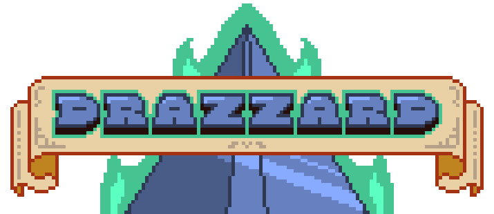

# Drazzard

### About
Drazzard involves you, our hero, maintaining control of the dungeon for as long as possible.  Enemies will continually spawn with more health, damage, speed, and wit, and it's up to you to survive!  The game provides perks in the form of a shop system, along with random boosts throughout the map.  Spend your points wisely to ensure you have the tools to reach a higher level than ever before!  The game is **very much still in development**, so features will be missing and there will be bugs.  The game will remain open source for anyone who wants to use/modify the code, or simply play the game.

### Details
The game is written entirely in [Lua](http://www.lua.org/) and utilizes the [Love2D](https://love2d.org/) framework.

### Shop Perks
| Perk	  | Information         												| Max Level Limit? |
|---      |---	                  												|---               |
| +FOV    | Increases the angle at which enemies can be attacked         	    | Yes |
| +Range  | Increases distance at which enemies will take damage from you 	    | Yes |
| +Gold   | Increases the amount of gold recieved after defeating an enemy      | Yes |
| +Health | Fully replenishes health & increases max health                     | No |
| +Stamina| Fully replenishes stamina & increases max stamina                   | No |
| +Power  | Increases max damage player can deal                                | No |

### Controls
| Key(s)	| Action         	|
|---      	|---	      		|
|  WASD 	|  Move         	|
|  LMB 	  	|  Sword attack 	|
|  Shift	|  Sprint 	        |
